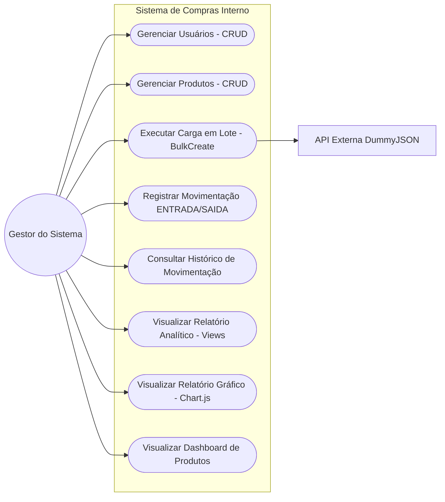
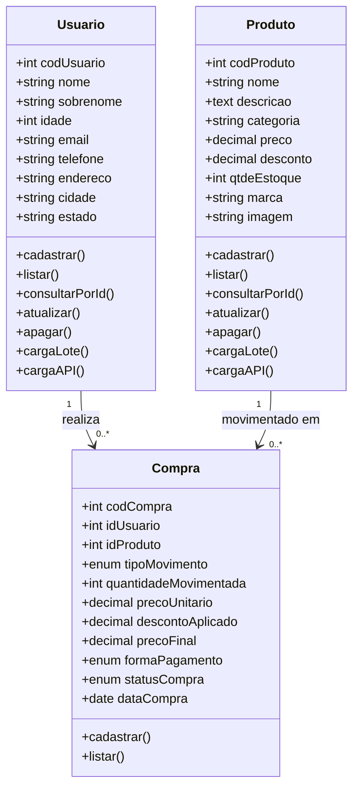
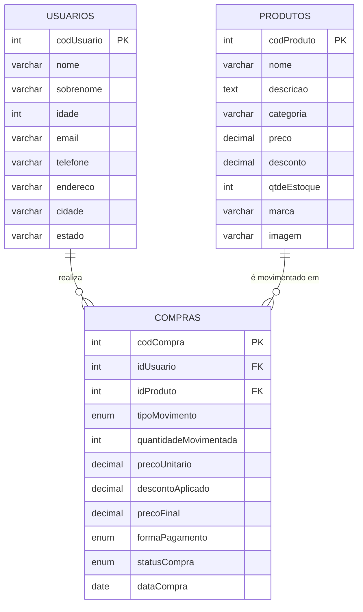

# Diagramas do Sistema de Compras Interno

Os diagramas abaixo estão em sintaxe **Mermaid**. Para gerar as imagens `.png` exigidas
na entrega, cole cada bloco em https://mermaid.live e exporte como PNG
(ou use o MySQL Workbench para o Diagrama Lógico via Engenharia Reversa).

## 1. Diagrama de Caso de Uso Geral (UML)

## 2. Diagrama de Classes (UML)

## 3. Diagrama Lógico do Banco de Dados (DER)

> Para a entrega oficial, gere este diagrama pela Engenharia Reversa do MySQL Workbench
> (Database » Reverse Engineer) após rodar `node sync.js` e `node criarViews.js`.

